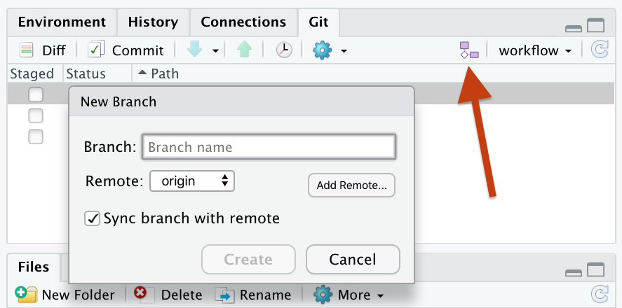
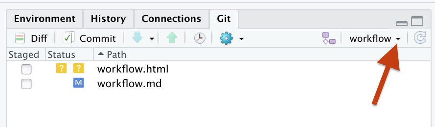

# Workflow

We are using a *Forking Workflow*: Everyone has their own fork of the main repo. Do your work locally on a branch of your fork of the main repo. To get your work into the main repo, you initiate a Pull Request.

Also documented here: https://happygitwithr.com/fork-and-clone.html

# Initial Setup

## Do once

On GitHub: fork the [`OSUCliMates/CliMates`](https://github.com/OSUCliMates/CliMates/issues/4) repo.  

## Do on each machine

* **Clone your fork**  Easiest approach is in RStudio: New Project -> From Version Control ->.  Copy and paste HTTPS repo link from "Clone/Download" button on your fork's GitHub page.

* **Set the main repo as `upstream`**. 
    
    **In the Terminal**: List the remotes your local repo knows about:
    
    ```shell
    git remote -v
    ```
    
    You should see your fork listed as `origin`, e.g.
    
    ```text
    origin  https://github.com/cwickham/CliMates.git (fetch)
    origin  https://github.com/cwickham/CliMates.git (push)
    ```
    
    If you don't have it, add the main repo as `upstream` ---  adds a shortcut called `upstream` that points to the main repo:
    
    ```shell
    git remote add upstream https://github.com/OSUCliMates/CliMates
    ```
    
    Check your local repo, now knows about your fork, and the main repo:
    
    ```shell
    git remote -v
    ```
    
    ```text
    origin  https://github.com/cwickham/CliMates.git (fetch)
    origin  https://github.com/cwickham/CliMates.git (push)
    upstream        https://github.com/OSUCliMates/CliMates (fetch)
    upstream        https://github.com/OSUCliMates/CliMates (push)
    ```
    
## Doing your own work

Don't make commits to the `master` branch.  Instead create a branch and commit your work there, e.g. to create and checkout a `workflow` branch.  Either on the Terminal:

```shell
git branch workflow
git checkout workflow
```

Or using the branch button in RStudio:


Make changes, commit, push when you want.  This pushes to your fork.

The first time you push your branch you might see an error:
```
fatal: The current branch work has no upstream branch.
To push the current branch and set the remote as upstream, use

    git push --set-upstream origin workflow
```

That is Git complaining it doesn't know where to push your branch.  Copy the suggestion into the Terminal to tell Git this branch should be pushed to your fork on GitHub (`origin`):

```shell
git push --set-upstream origin workflow
```

When you are ready to suggest the changes to the main repo.  Start a pull request from your branch in your fork on GitHub.  

**Your PR is merged?** You can delete your branch, then update the
`master` branch of your fork to match the main repo.

## Keeping up-to-date

See also: https://happygitwithr.com/upstream-changes.html#upstream-changes

Make sure you are on the `master` branch.  On the Terminal:
```shell
git checkout master
```

Or use the branch menu in RStudio in the Git tab:


I'm currently on the `workflow` branch, I shoud be on `master`.

Fetch changes from main repo on GitHub:
```shell
git fetch upstream
```

Then merge them:
```shell
git merge upstream/master
```

Finally, push to your fork on GitHub:
```shell
git push
```


